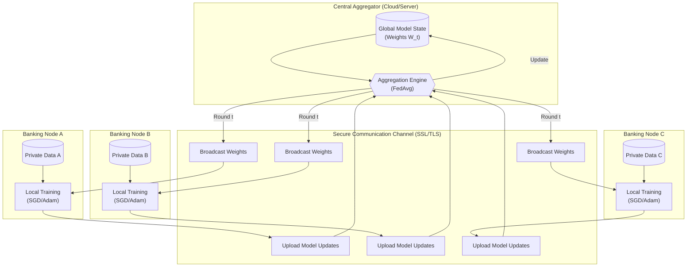
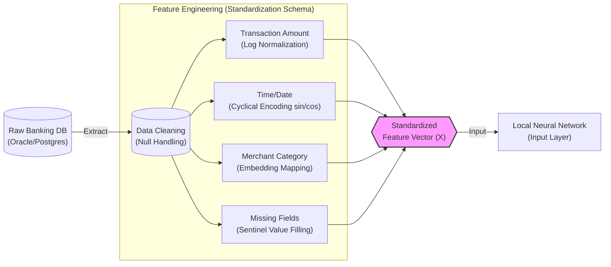
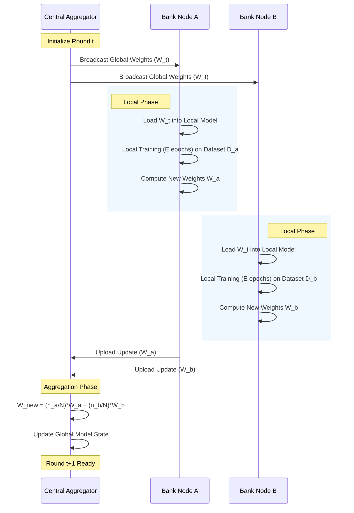
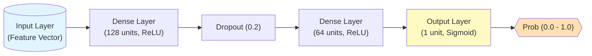

# Visualizations for Thesis

## Figure 1: High-Level System Architecture
This diagram illustrates the "Hub-and-Spoke" topology where the Central Aggregator coordinates the training without accessing the Banking Nodes' private data.

## Figure 2: Data Harmonization Pipeline
This diagram details how heterogeneous raw data from different banks is transformed into a standardized feature vector before entering the training loop.

## Figure 3: Sequence Diagram of a Training Round
This sequence diagram shows the chronological flow of operations for a single Federated Learning round.

## Figure 4: Neural Network Architecture for Fraud Detection
Illustrating the specific definitions of layer discussed in the methodology.

